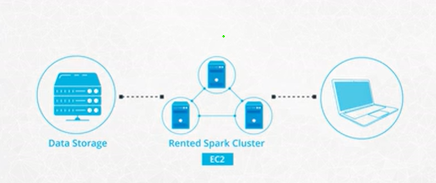

# Setting Up Spark Clusters with AWS

This section contains information that will help you understand the following

- Distinguish between setting up a Spark Cluster using both Local and Standalone Mode
- Set up Spark Cluster in AWS
- Use Spark UI
- Use AWS CLI
- Create EMR using AWS CLI
- Create EMR Cluster
- Test Port Forwarding
- Use Notebooks on your Spark Cluster
- Write Spark Scripts
- Store and Retrieve data on the Cloud
- Read and Write to Amazon S3
- Understand the distinction between HDFS and S3
- Reading and Writing Data to HDFS

## Spark Cluster in Local and Standalone Mode

In Local Mode: You are running a Spark program on your laptop like a single machine.

In Standalone Mode: You are defining Spark Primary and Secondary to work on your (virtual) machine. You can do this on EMR or your machine. Standalone mode uses a resource manager like YARN or Mesos.

### Overview of the Set up of a Spark Cluster
- Amazon S3 will store the dataset.
- We rent a cluster of machines, i.e., our Spark Cluster, and iti s located in AWS data centers. We rent these using AWS service called Elastic Compute Cloud (EC2).
- We log in from your local computer to this Spark cluster.
- Upon running our Spark code, the cluster will load the dataset from Amazon S3 into the cluster’s memory distributed across each machine in the cluster.

## Setup Instructions on AWS
HDFS (Hadoop Distributed File System) is a file system. HDFS uses MapReduce system as a resource manager.

Spark can replace the MapReduce algorithm. Since Spark does not have its own distributed storage system, it leverages using HDFS or AWS S3, or any other distributed storage. Primarily in this course, we will be using AWS S3, but let’s review the advantages of using HDFS over AWS S3.

### What is HDFS?
HDFS (Hadoop Distributed File System) is the file system in the Hadoop ecosystem. Hadoop and Spark are two frameworks providing tools for carrying out big-data related tasks. While Spark is faster than Hadoop, Spark has one drawback. It lacks a distributed storage system. In other words, Spark lacks a system to organize, store and process data files.

### MapReduce System
HDFS uses MapReduce system as a resource manager to allow the distribution of the files across the hard drives within the cluster. Think of it as the MapReduce System storing the data back on the hard drives after completing all the tasks.

Spark, on the other hand, runs the operations and holds the data in the RAM memory rather than the hard drives used by HDFS. Since Spark lacks a file distribution system to organize, store and process data files, Spark tools are often installed on Hadoop because Spark can then use the Hadoop Distributed File System (HDFS).

### How to Why do you need EMR Cluster?
Since a Spark cluster includes multiple machines, in order to use Spark code on each machine, we would need to download and install Spark and its dependencies. This is a manual process. Elastic Map Reduce is a service offered by AWS that negates the need for you, the user, to go through the manual process of installing Spark and its dependencies for each machine.

### Setting up AWS
Please refer to the latest [AWS documentation to set up an EMR Cluster](https://docs.aws.amazon.com/emr/latest/ManagementGuide/emr-gs-launch-sample-cluster.html).