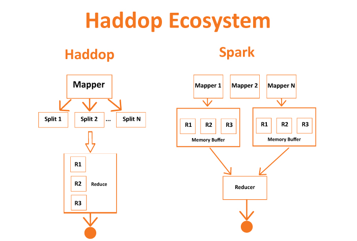
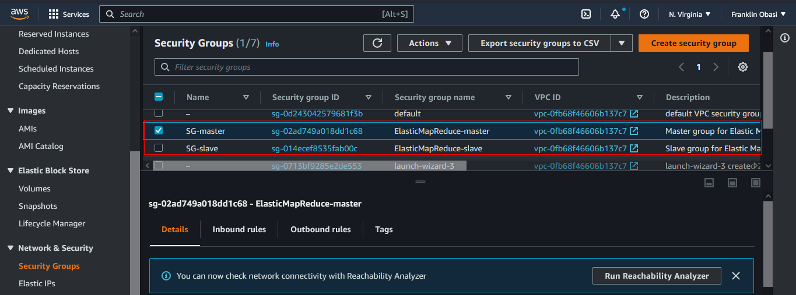
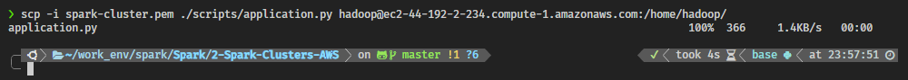
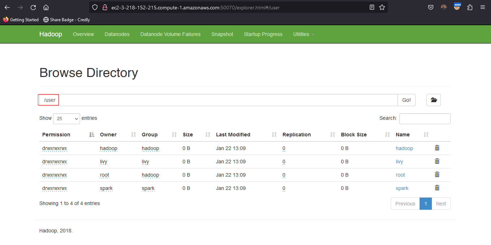

# Setting Up Spark Clusters with AWS

This section contains information that will help you understand the following

- Distinguish between setting up a Spark Cluster using both Local and Standalone Mode
- Set up Spark Cluster in AWS
- Use Spark UI
- Use AWS CLI
- Create EMR using AWS CLI
- Create EMR Cluster
- Test Port Forwarding
- Use Notebooks on your Spark Cluster
- Write Spark Scripts
- Store and Retrieve data on the Cloud
- Read and Write to Amazon S3
- Understand the distinction between HDFS and S3
- Reading and Writing Data to HDFS

## Spark Cluster in Local and Standalone Mode

In Local Mode: You are running a Spark program on your laptop like a single machine.

In Standalone Mode: You are defining Spark Primary and Secondary to work on your (virtual) machine. You can do this on EMR or your machine. Standalone mode uses a resource manager like YARN or Mesos.


### Overview of the Set up of a Spark Cluster
- Amazon S3 will store the dataset.
- We rent a cluster of machines, i.e., our Spark Cluster, and iti s located in AWS data centers. We rent these using AWS service called Elastic Compute Cloud (EC2).
- We log in from your local computer to this Spark cluster.
- Upon running our Spark code, the cluster will load the dataset from Amazon S3 into the cluster’s memory distributed across each machine in the cluster.

## Setup Instructions on AWS
HDFS (Hadoop Distributed File System) is a file system. HDFS uses MapReduce system as a resource manager.

Spark can replace the MapReduce algorithm. Since Spark does not have its own distributed storage system, it leverages using HDFS or AWS S3, or any other distributed storage. Primarily in this course, we will be using AWS S3, but let’s review the advantages of using HDFS over AWS S3.

### What is HDFS?
HDFS (Hadoop Distributed File System) is the file system in the Hadoop ecosystem. Hadoop and Spark are two frameworks providing tools for carrying out big-data related tasks. While Spark is faster than Hadoop, Spark has one drawback. It lacks a distributed storage system. In other words, Spark lacks a system to organize, store and process data files.

### MapReduce System
HDFS uses MapReduce system as a resource manager to allow the distribution of the files across the hard drives within the cluster. Think of it as the MapReduce System storing the data back on the hard drives after completing all the tasks.

Spark, on the other hand, runs the operations and holds the data in the RAM memory rather than the hard drives used by HDFS. Since Spark lacks a file distribution system to organize, store and process data files, Spark tools are often installed on Hadoop because Spark can then use the Hadoop Distributed File System (HDFS).



### Why do you need EMR Cluster?
Since a Spark cluster includes multiple machines, in order to use Spark code on each machine, we would need to download and install Spark and its dependencies. This is a manual process. **Elastic Map Reduce** is a service offered by AWS that negates the need for you, the user, to go through the manual process of installing Spark and its dependencies for each machine.

### Setting up AWS EMR
Please refer to the latest [AWS documentation to set up an EMR Cluster](https://docs.aws.amazon.com/emr/latest/ManagementGuide/emr-gs-launch-sample-cluster.html).

## AWS Install and CLI configuration

_The AWS Command Line Interface (AWS CLI) is a command-line tool that allows you to interact with AWS services using commands in your terminal/command prompt._

AWS CLI enables you to run commands to provision, configure, list, delete resources in the AWS cloud. Before you run any of the aws commands, you need to follow three steps:

- Install AWS CLI
- Create an IAM user with Administrator permissions
- Configure the AWS CLI


## Create EMR Cluster Using AWS CLI

Let's learn how to create an EMR cluster from the CLI, and configure the related settings.

**`aws emr create-cluster` command**

While creating EMR through AWS console has been shown, but if you know your instances' specificity, such as which applications you need or what kind of clusters you’ll need, you can reuse the aws emr create-cluster command below multiple times.

```

aws emr create-cluster --name <cluster_name> \
 --use-default-roles --release-label emr-5.28.0  \
--instance-count 3 --applications Name=Spark Name=Zeppelin  \
--bootstrap-actions Path="s3://bootstrap.sh" \
--ec2-attributes KeyName=<Key-pair-file-name>,SubnetId=<subnet-Id> \
--instance-type m5.xlarge --log-uri s3:///emrlogs/

```

1. **Options**: Let’s break down the command above and go over each option.
 - `--name` : You can give any name of your choice. This will show up on your AWS EMR UI.
 - `--release-label`: This is the version of EMR you'd like to use.
- `--instance-count`: Annotates instance count. One is for the primary, and the rest are for the secondary. For example, if --instance-count is given 4, then 1 instance will be reserved for primary, then 3 will be reserved for secondary instances.
- `--applications`: List of applications you want to pre-install on your EMR at the launch time
- `--bootstrap-actions`: The `Path` attribute provides the path to a file (residing in S3 or locally) that contains a script that runs during a bootstrap action. The script may set environmental variables in all the instances of the cluster. This file must be accessible to each instance in the cluster.
- `--ec2-attributes`: The `KeyName` field specifies your key-pair file name, for example, if it is MyKey.pem, just specify `MyKey` for this field. There is one more field that you should specify, `v `.
The [aws documentation](https://docs.aws.amazon.com/emr/latest/ManagementGuide/emr-managed-notebooks-considerations.html) says that the cluster must be launched within an EC2-VPC. Therefore, you need to provide the VPC subnet Id in which to create the cluster. If you do not specify this value, the cluster is launched in the normal AWS cloud, outside of any VPC. Go to the [VPC service](https://console.aws.amazon.com/vpc) in the web console to copy any of the subnet IDs within the [default VPC](https://docs.aws.amazon.com/vpc/latest/userguide/default-vpc.html#create-default-vpc). If you do not see a default VPC in your account, use a simple command to create a default VPC:

```
aws ec2 create-default-vpc --profile <profile-name>
```

See the snapshot below to copy the subnet Id.


- `--instance-type`: Specify the type of instances you want to use. [Detailed list can be accessed here](https://docs.aws.amazon.com/emr/latest/ManagementGuide/emr-supported-instance-types.html), but find the one that can fit your data and your budget.
- `--log-uri`: S3 location to store your EMR logs in. This log can store EMR metrics and also the metrics/logs for submission of your code.


2. **Reference** - You can refer to an even more detailed explanation about all possible options of the `aws emr create-cluster` command at CLI command reference. 

### Exercise: Create an EMR cluster using AWS CLI
Follow the instructions given below

#### Prerequisite

1. **AWS CLI** - Install AWS CLI on your local computer. Refer to the [AWS instructions to install/update AWS CLI](https://docs.aws.amazon.com/cli/latest/userguide/install-cliv2.html) (version 2) based on your underlying OS.

2. **Set up Access credentials using AWS IAM** - Generate and save a new Access key (access key ID, and a secret key) locally in your system, which will allow your CLI to create an EMR cluster. You will have to configure the environment variables so that the `aws configure` command can run properly.

3. **EC2 Login Key-Pair** - You should have an EC2 login key-pair to access your EC2 instances in the cluster. You can generate a key-pair from the [EC2 dashboard](https://console.aws.amazon.com/ec2/v2/home). Remember, a key-pair is a pair of (encrypted) public and (unencrypted PEM encoded) private keys. The public key is placed automatically on the instance, and the private key is made available to the user, just once. Suppose, your private key file name is AWS_EC2_Demo.pem, then you should use only "AWS_EC2_Demo" in the script below, with the option `--ec2-attributes`.

#### Create An EMR Cluster

1. **Create default roles in IAM** - Before you run the `aws emr create-cluster` command, make sure to have the necessary roles created in your account. Use the following command.

```
aws emr create-default-roles --profile <profile-name>
```

2. **Launch your cluster** - Run the script below to launch your cluster. Be sure to replace the appropriate names within the `<>` in the command below.

```
# Provide cluster name, EC2 private key file name, and profile name
aws emr create-cluster \
--name <YOUR_CLUSTER_NAME> \
--use-default-roles \
--release-label emr-5.28.0 \
--instance-count 3 \
--applications Name=Spark  \
--ec2-attributes KeyName=<Key-pair-file-name>,SubnetId=<subnet-Id> \
--instance-type m5.xlarge \
--auto-terminate \
--profile <profile-name>
```

Notice two things in the command above.

- One, we have added the `--auto-terminate` option to terminate the cluster after completing all the steps because EMR clusters are costly. However, you can ignore this option, and [terminate the cluster manually](https://docs.aws.amazon.com/emr/latest/ManagementGuide/UsingEMR_TerminateJobFlow.html) after your job is done.
- Two, we haven't specified the `--bootstrap-actions` option. This step is optional.
[Optional] Specify your bootstrap file - You should save an executable (bootstrap_emr.sh file) in an accessible S3 location. You can specify this option as, for example, `--bootstrap-actions Path=s3://mybucket/bootstrap_emr.sh` in the command below. A sample file is provided in the Github repo [here](./scripts/bootstrap_emr.sh).

The expected output should look similar to this:

```
"ClusterId": "j-4JWRD5WOPN6A",
"ClusterArn": "arn:aws:elasticmapreduce:us-east-1:265646434158:cluster/j-4JWRD5WOPN6A"
```

Snapshot:


3. You can either go to [AWS EMR console](https://console.aws.amazon.com/elasticmapreduce/home) from your web browser or run the command below to verify if the cluster is created successfully.

```
# Provide cluster ID and the profile name
aws emr describe-cluster --cluster-id <CLUSTER_ID FROM ABOVE> --profile <profile-name>

```


#### Change Security Groups

1. After successfully launching the EMR cluster, the master and core (slave) EC2 instances will launch automatically. Next, we will try to log in to the master EC2 instance on the EMR cluster using the SSH protocol (allows secure remote login). Therefore, you’ll need to enable the Security Groups setting of the master EC2 instance to accept incoming SSH protocol from your local computer.

The master and slave nodes are associated with a separate security group. You can view the security group ID either in the **EMR console** → **Clusters** or you can go to the **EC2 dashboard** → **Security Groups** service, as shown below.



2. Edit the security group to authorize inbound SSH traffic (port 22) from your local computer. 


3. **Reference** - [Authorize inbound traffic](https://docs.aws.amazon.com/emr/latest/ManagementGuide/emr-connect-ssh-prereqs.html)

####  Verify connection to the Master node
1. Go to the EC2 dashboard, and select the instance you want to connect using the SSH protocol.


2. Connect using the SSH protocol. You can run the commands shown in the figure below below in your terminal.

**NOTE** - In the snapshot below, the user name to log in is not `root`. Instead, you must use `hadoop`.
For example, use 
```
ssh -i "spark-cluster.pem" hadoop@ec2-3-235-155-149.compute-1.amazonaws.com
```


3. Reference - [Connect to the Master Node Using SSH](https://docs.aws.amazon.com/emr/latest/ManagementGuide/emr-connect-master-node-ssh.html).


#### View Spark UI hosted on the EMR Clusters

One last thing to do before using the Jupyter Notebook, or even browsing the Spark UI, is to set up a proxy in your browser. It is a two-step process. 

**STEP 1 - Set Up an SSH Tunnel to the Master Node Using Dynamic Port Forwarding**

1. Enable the dynamic port forwarding using the command. This command does not returns a response.

```
ssh -i "spark-cluster.pem" -N -D 8157 hadoop@ec2-3-235-155-149.compute-1.amazonaws.com
```

_Replace the .pem file name and the master node public DNS for you. In the above example, the .pem is residing in the present working folder. If your .pem is placed in any different folder, you can provide the complete path._

In the command above, the `-D` option is used for specifying a local port (8157) to forward data to all remote ports on the master node's web server.

2. Now, you'd want to copy your .pem file (EC2 log in private key) to the master node. You can securely copy your .pem file from your local computer to the master node, using:

```
scp -i spark-cluster.pem spark-cluster.pem hadoop@ec2-3-235-155-149.compute-1.amazonaws.com:/home/hadoop/
```

3. **Reference** - [Set Up an SSH Tunnel to the Master Node Using Dynamic Port Forwarding](https://docs.aws.amazon.com/emr/latest/ManagementGuide/emr-ssh-tunnel.html)

**STEP 2 - Configure Proxy Settings in your Local Computer**

To do this, you'll need to install an extension in your browser. Here are the options:

- Chrome - SwitchyOmega or FoxyProxy
- Firefox - FoxyProxy

The snapshots below present the step for the Firefox browser. For other browsers, you can follow the reference link present at the end of the section.

1. In Firefox, go to https://addons.mozilla.org/, search for FoxyProxy Standard, and follow the instructions to add FoxyProxy to Firefox.


2. Using a text editor, create a JSON file named `foxyproxy-settings.json` from the following example configuration.

```
{
  "k20d21508277536715": {
    "active": true,
    "address": "localhost",
    "port": 8157,
    "username": "",
    "password": "",
    "type": 3,
    "proxyDNS": true,
    "title": "emr-socks-proxy",
    "color": "#0055E5",
    "index": 9007199254740991,
    "whitePatterns": [
      {
        "title": "*ec2*.amazonaws.com*",
        "active": true,
        "pattern": "*ec2*.amazonaws.com*",
        "importedPattern": "*ec2*.amazonaws.com*",
        "type": 1,
        "protocols": 1
      },
      {
        "title": "*ec2*.compute*",
        "active": true,
        "pattern": "*ec2*.compute*",
        "importedPattern": "*ec2*.compute*",
        "type": 1,
        "protocols": 1
      },
      {
        "title": "10.*",
        "active": true,
        "pattern": "10.*",
        "importedPattern": "http://10.*",
        "type": 1,
        "protocols": 2
      },
      {
        "title": "*10*.amazonaws.com*",
        "active": true,
        "pattern": "*10*.amazonaws.com*",
        "importedPattern": "*10*.amazonaws.com*",
        "type": 1,
        "protocols": 1
      },
      {
        "title": "*10*.compute*",
        "active": true,
        "pattern": "*10*.compute*",
        "importedPattern": "*10*.compute*",
        "type": 1,
        "protocols": 1
      },
      {
        "title": "*.compute.internal*",
        "active": true,
        "pattern": "*.compute.internal*",
        "importedPattern": "*.compute.internal*",
        "type": 1,
        "protocols": 1
      },
      {
        "title": "*.ec2.internal* ",
        "active": true,
        "pattern": "*.ec2.internal*",
        "importedPattern": "*.ec2.internal*",
        "type": 1,
        "protocols": 1
      }
    ],
    "blackPatterns": []
  },
  "logging": {
    "size": 100,
    "active": false
  },
  "mode": "patterns",
  "browserVersion": "68.12.0",
  "foxyProxyVersion": "7.5.1",
  "foxyProxyEdition": "standard"
}
```

3. Open the Firefox **Manage Your Extensions** page (go to **about:addons**, then choose **Extensions**).

4. Choose **FoxyProxy Standard**, then choose the more options button (the button that looks like an ellipsis).

5. Select **Options** from the dropdown.

6. Choose **Import Settings** from the left menu.

7. On the **Import Settings** page, choose **Import Settings** under **Import Settings from FoxyProxy 6.0+**, browse to the location of the `foxyproxy-settings.json` file you created, select the file, and choose Open.

8. Choose **OK** when prompted to overwrite the existing settings and save your new configuration.

9. Once, you have configured the proxy, you can access the Spark UI using the command (replace the master node public DNS for you):

```
http://ec2-3-235-155-149.compute-1.amazonaws.com:18080/
```


## Jupyter / Zeppelin Notebook
There are a couple of options for which notebook to use. We can use a Jupyter Notebook, or use a Zeppelin notebook. If you are already familiar with Jupyter Notebooks, continue using them.

### Advantages of using Zeppelin Notebook
While the use of Jupyter Notebook is common across the industry, you can explore using Zeppelin notebooks. Zeppelin notebooks have been available since EMR 5.x versions, and they have direct access to Spark Context, such as a local spark-shell. For example, if you type sc, you’ll be able to get Spark Context within Zeppelin notebooks.

Zeppelin is very similar to Jupyter Notebook, but if you want to use other languages like Scala or SQL, on top of using Python, you can use Zeppelin instead.

### How to create a notebook on Amazon EMR

1. 

2. 

3. 


## What is a Spark Script
Up until now, you have been using jupyter notebooks. Jupyter notebooks are great for prototyping, exploring and visualizing data and It is also shareable among colleagues and teams.
However, Jupyter notebooks aren't the best for automating workflows.
Python scripts are.

## Submitting A Spark Script

1. Download [`cities.csv`](./datasets/cities.csv) to your local machine
2. Upload a file into an S3 location using the AWS S3 console, or you can use the AWS CLI command.
  - create an s3 bucket using the command
    ```
    aws s3 mb s3://<bucket_name>
    ```

  - Copy `cities.csv` file to the s3 bucket using the command:
l   ```
    aws s3 cp <your current file location>/<csv-filename> s3://<bucket_name>
    ```

3. [Create an EMR](#create-emr-cluster-using-aws-cli)
   
   

4. copy this [Python script](./scripts/application.py) to to your EMR instance, preferably in your home directory of EMR instance (master node).
  - use scp command to copy file from local machine to master node
  Replace the private key with the path to your private key, the source file with the path to your sourcefile
  ```
  scp -i spark-cluster.pem ./scripts/application.py hadoop@<ec2-Publc_IPv4-address>:/home/hadoop/
  ```
  

  

5. ssh to the master node, and execute the file using
  ```
  spark-submit application.py.
  ```
  

  - View your spark UI and refresh the page:

  

  

## Storing and Retrieving Data on Cloud
One of the simple ways to store big data in cloud is by using Amazon Simple Storage Service (S3). 

### Reading and Writing to Amazon S3

With the convenient AWS UI, we can easily mistake AWS S3 (Simple Storage Service) equivalent as Dropbox or even Google Drive. This is not the case for S3. S3 stores an object, and when you identify an object, you need to specify a bucket, and key to identify the object. For example,

```
df = spark.read.load("s3://my_bucket/path/to/file/file.csv")
```

From this code, s3://my_bucket is the bucket, and path/to/file/file.csv is the key for the object. Thankfully, if we’re using spark, and all the objects underneath the bucket have the same schema, you can do something like below.

```
df = spark.read.load("s3://my_bucket/")
```

This will generate a dataframe of all the objects underneath the `my_bucket` with the same schema. Pretend some structure in s3 like below:

```
my_bucket
  |---test.csv
  path/to/
     |--test2.csv
     file/
       |--test3.csv
       |--file.csv
```

If all the csv files underneath my_bucket, which are test.csv, test2.csv, test3.csv, and file.csv have the same schema, the dataframe will be generated without error, but if there are conflicts in schema between files, then the dataframe will not be generated. As an engineer, you need to be careful on how you organize your data lake.

see an example here: [`Here`](./scripts/test-emr.ipynb)

## Differences between HDFS and AWS S3

Since Spark does not have its own distributed storage system, it leverages using HDFS or AWS S3, or any other distributed storage. Let’s review the advantages of using HDFS over AWS S3.

Although it would make the most sense to use AWS S3 while using other AWS services, it’s important to note the differences between AWS S3 and HDFS.

- AWS S3 is an object storage system that stores the data using key value pairs, namely bucket and key, and HDFS is an actual distributed file system which guarantees fault tolerance. HDFS achieves fault tolerance by having duplicate factors, which means it will duplicate the same files at 3 different nodes across the cluster by default (it can be configured to different numbers of duplication).

- HDFS has usually been installed in on-premise systems, and traditionally have had engineers on-site to maintain and troubleshoot Hadoop Ecosystem, which cost more than having data on cloud. Due to the flexibility of location and reduced cost of maintenance, cloud solutions have been more popular. With extensive services you can use within AWS, S3 has been a more popular choice than HDFS.

- Since AWS S3 is a binary object store, it can store all kinds of format, even images and videos. HDFS will strictly require a certain file format - the popular choices are avro and parquet, which have relatively high compression rate and which makes it useful to store large dataset.

## Reading and Writing Data to HDFS

1. Using the same emr cluster created above, make sure the ssh dynamic port tunnelling i active.

2. Click `Application user interface` tab as shown below:


3. Beside `HDFS Name Node` Application under the `On-cluster application user interface`, copy the `User Interface URL` as shown below:


4. Open the link in a new tab in your browser


5. On the top menu, select `Utilities` -> `Browse the file system`


This is the Amazon emr HDFS. Next, let's see how we can write and read files to the user directory




6. ssh to the emr cluster master node

```
ssh -i "spark-cluster.pem" hadoop@ec2-3-218-152-215.compute-1.amazonaws.com
```


7. Download the datasets - [sparkify_log_small.json](./datasets/sparkify_log_small.json) and [sparkify_log_small_2.json](./datasets/sparkify_log_small_2.json) to your local file storage.

Mine is aved in a folder called `datasets`.

Use `scp` command to coppy the download files to the emr cluster master node using the command below:

```
scp -i spark-cluster.pem datasets/sparkify_log_small*.json hadoop@ec2-3-218-152-215.compute-1.amazonaws.com:/home/hadoop/
```

8. After copy operation is completed, go back to the emr cluster master node to confirm if the files were sent successfully using the `ls` command.


9. Now that we have the files in the master node, let's move the files to the HDFS.

To keep things organize, we will first create a folder in the HDFS called `sparkify-data`, within the `user` directory. We intend the copt the json files to the newly created `sparkify-data` directory

- To create a directory in the HDFS, use the command
  ```
  hdfs dfs -mkdir /user/sparkify-data
  ```


- Copy the json files to the `sparkify-data` using the command:
```
hdfs dfs -copyFromLocal sparkify_log_small*.json /user/sparkify-data/
```


We have successfully written file to the HDFS.

10. Using spark, we can read data from the HDFS using a url to follows this format:

```
hdfs:///<path>/filename
```

for example the url to the json file can be written as:

```
hdfs:///user/sparkify_data/sparkify_log_small_2.json
```

See the codes [here](./scripts/test-emr.ipynb)