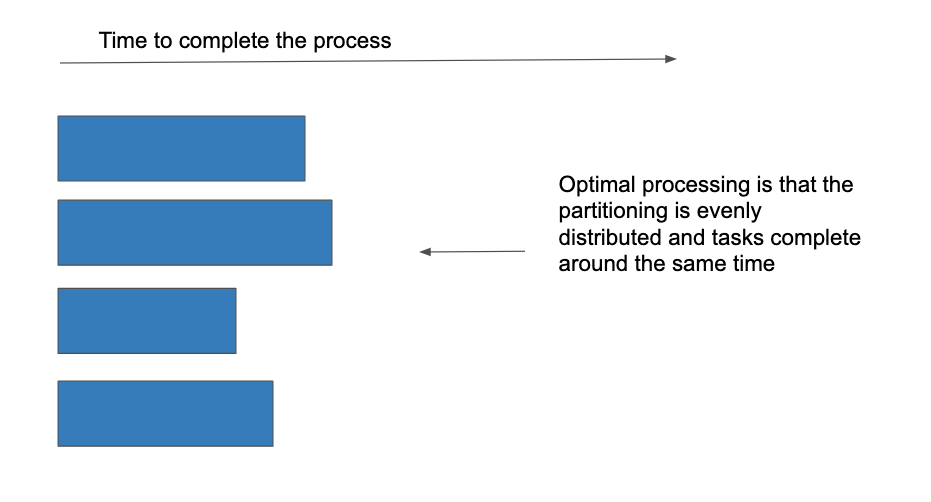

# Debugging and Optimization

## What are Accumulators?

As the name hints, accumulators are variables that accumulate. Because Spark runs in distributed mode, the workers are running in parallel, but asynchronously. For example, worker 1 will not be able to know how far worker 2 and worker 3 are done with their tasks. With the same analogy, the variables that are local to workers are not going to be shared to another worker unless you accumulate them. Accumulators are used for mostly sum operations, like in Hadoop MapReduce, but you can implement it to do otherwise.

## What is Spark Broadcast?

Spark Broadcast variables are secured, read-only variables that get distributed and cached to worker nodes. This is helpful to Spark because when the driver sends packets of information to worker nodes, it sends the data and tasks attached together which could be a little heavier on the network side. Broadcast variables seek to reduce network overhead and to reduce communications. Spark Broadcast variables are used only with Spark Context.

## Transformations and Actions

There are two types of functions in Spark:

- **Transformations**
- **Actions**

Spark uses **lazy evaluation** to evaluate RDD and dataframe. Lazy evaluation means the code is not executed until it is needed. The **action** functions trigger the lazily evaluated functions.

For example,

```
df = spark.read.load("some csv file")
df1 = df.select("some column").filter("some condition")
df1.write("to path")
```

- In this code, `select` and `filter` are **transformation** functions, and `write` is an **action** function.
  
- If you execute this code line by line, the second line will be loaded, but **you will not see the function being executed in your Spark UI.** 
  
- When you actually **execute using action** `write`, then you will see your Spark program being executed:

    - `select` --> `filter` --> `write` chained in Spark UI
    - but you will only see `Write` show up under your tasks.

This is significant because you can chain your **RDD** or dataframe as much as you want, but it might not do anything until you actually **trigger** with some **action words**. And if you have lengthy **transformations**, then it might take your executors quite some time to complete all the tasks.

## Understanding Data Skewness

In the real world, you’ll see a lot of cases where the data is skewed. Skewed data means due to non-optimal partitioning, the data is heavy on few partitions. This could be problematic. Imagine you’re processing this dataset, and the data is distributed through your cluster by partition. In this case, only a few partitions will continue to work, while the rest of the partitions do not work. If you were to run your cluster like this, you will get billed by the time of the data processing, which means you will get billed for the duration of the longest partitions working. This isn’t optimized, so we would like to re-distribute the data in a way so that all the partitions are working.

### Figure A. Time to process with non-optimal partitioning with skewed data


### Figure B. Time to process with optimal partitioning with skewed data



In order to look at the skewness of the data:

- Check for MIN, MAX and data RANGES
- Examine how the workers are working
- Identify workers that are running longer and aim to optimize it.

## Optimizing for Data Skewness

### Use Cases in Business Datasets

Skewed datasets are common. In fact, you are bound to encounter skewed data on a regular basis. As one might expect, retail business is likely to surge during Thanksgiving and Christmas, while the rest of the year would be pretty flat. Skewed data indicators: If we were to look at that data, partitioned by month, we would have a large volume during November and December. We would like to **process this dataset through Spark using different partitions**, if possible. What are some ways to solve skewness?

- Data preprocess
  
- Broadcast joins

- Salting
