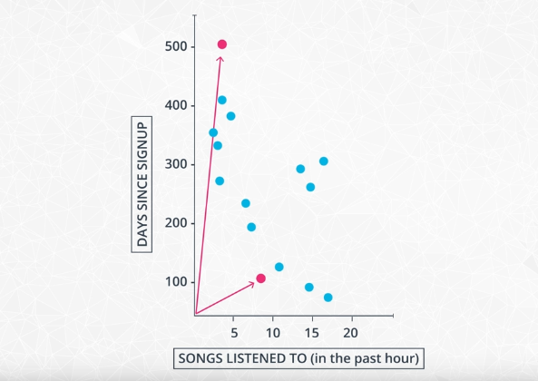
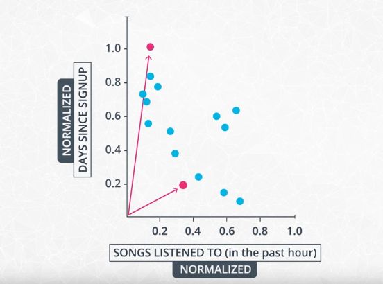
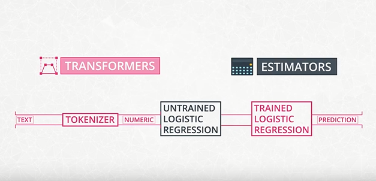
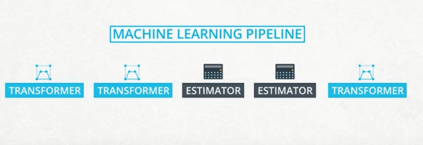
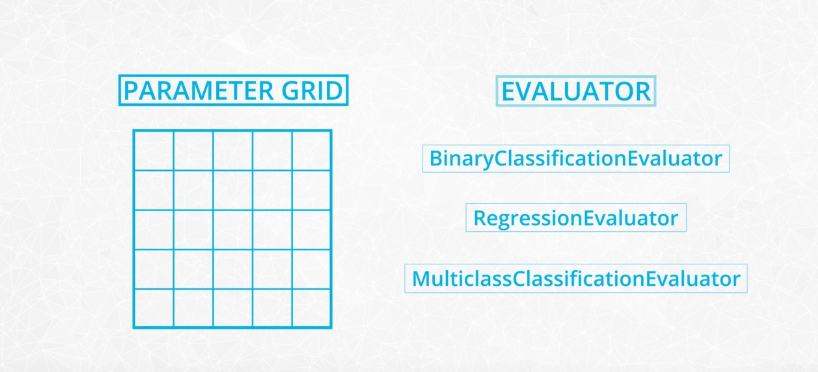

# Machine Learning with Spark

Just as spark dataframe were designed closely to immitate Python and R dataframes, the SparkML library resembles Scikit-Learn.

SparkML support pipelines, where we can stitch together data cleaning and feature engineering steps with model training and prediction.

Spark in general, handles algorithms that scale linearly with input data size.

In the sparkML library, we find support for:

- Supervised learning
- Unspervised learning
- Feature computation
- Hyperparameter tuning
- Model evaluation

## Distributed Machine Learning: Machine Learning in Paralllelization

There are two different ways to achieve parallelization in machine learning:

1. Data parallelization
2. Task parallelization

In data parallelization, we can use a large dataset and train the same model on smaller subsets of the data in parallel. This is spark's default behaviour. Spark's driver program acts as a perimeter server for most algorithm, where the partial results of each iteration gets combined.

In task parallelization, training of many models is done in parallel on a single dataset small enough to fit on a single machine.

### Feature engineering

Before we can start feeding features into any ML algorithm, we need to make sure that the inputs is in the correct format.
Just as most other ML libraries, SparkML expects numeric input values.
So if you are dealing with categorical variables or free-form text, you will need to transform the features first. Even for numeric data, we might need to rescale a particular feature to enhance certain algorithm performance.

Let's consider an example about how many song a user listened to in the pat hour versus how many days ago they started using the service. If you use a classifier that classifies the distance between the data points based on euclidean distance, the feature divided range may dominate the result.

This is why we need to normalize our features to the same range, typically between 0 and 1 or -1 and 1.

Spark supports many different scaling approaches:

**Numerical Variables(Scalers)**:
- [Normalizer](https://spark.apache.org/docs/latest/ml-features.html#normalizer)
- [StandardScaler](https://spark.apache.org/docs/latest/ml-features.html#standardscaler)
- [MinMaxScaler](https://spark.apache.org/docs/latest/ml-features.html#minmaxscaler)
- [MaxAbsScale](https://spark.apache.org/docs/latest/ml-features.html#maxabsscaler)

**Categorical Variables(Indexers)**:
- [StringIndexer](https://spark.apache.org/docs/latest/ml-features.html#stringindexer)
- [IndexToString](https://spark.apache.org/docs/latest/ml-features.html#indextostring)
- [VectorIndexer](https://spark.apache.org/docs/latest/ml-features.html#vectorindexer)

see an example - [here](notebooks/1_numeric_features.ipynb)

### Supervised ML Algorithms

Spark supports the most common algorithms for binary and multiclass classificaton such as :

- Logistic regression
- Random forest
- Gradient-boosted trees
- Support vector machines
- Naive bayes

For regression, park has builtin methods for:

- Linear regression
- Generalized linear regression
- Tree-based regression

### Unsupervised Learning

The second big category in ML is unsupervised algorithms, where we don't have any labeled data points. We typicalllytry to find clusters based on how similar records are to one another. The spark ML API inclueds
- K-means
- latent dirichlet Allocation
- Gaussian Mixture Model

In real life, problems don't necessarily fit strictly in either supervised or unsupervised category. So there has been a lot of development on techniques that implement hybrid approaches. Spark at this point haas limited support for `semi-supervied learning`. As mentioned earlier, spark primarily supports algorithms that scale linearly with the number of records. So if you need to use more expensive algorithms like connective-based clustering, which typically scales quadratically or even cubic with the number of records, You need to implement your own methods or consider using some other frameworks.

code examples - [here](notebooks/ml_with_spark.ipynb)

### Machine Learning Pipelines

Spark ML Pipeline API was inspired by Scikit-Learn, and just like scikit-learn, it allows combining several dataprocessing and other training steps into a single workflow.
Workflow Pipelines have two main components:
1. Transformers
2. Estimators

The **`transformer`** is an algorithm that transforms one dataframe to another. There are two common places where transformers are used:
1. Feature transformation
2. Tranforming features using a model into predicted outcomes.

**`Estimators`** fit algorithm parameters on a dataframe to create a transformer.

A **`Pipeline`** chains multiple transformers and estimators together to create an ML workflow.

### Model Selection and Tuning

Spark allows **`Hyperparameter tuning`** through both:
- Single Train-Test split
- K-flod cross validation

We can tune a single estimator or a whole pipeline by specifiying two additional objects:

1. Parameter grid
2. Evaluator

Estimators define the metric that will be used to evaluate the results on the test set.

It is worth noting that after identifying the best parametercombination using the built-in cross validation methods, spark fits the estimators using the best parameter map and the entire dataset.