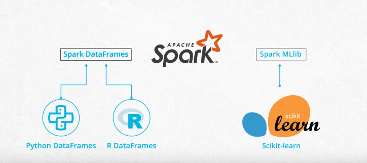
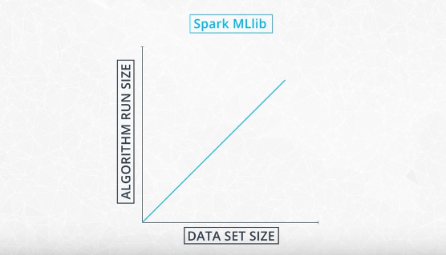
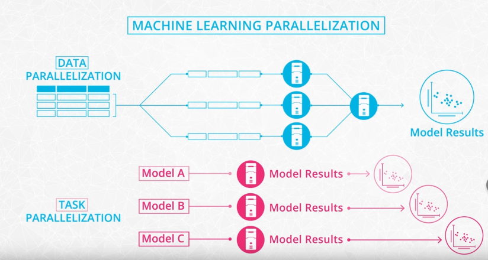

# Machine Learning with Spark

Just as spark dataframe were designed closely to immitate Python and R dataframes, the SparkML library resembles Scikit-Learn.

SparkML support pipelines, where we can stitch together data cleaning and feature engineering steps with model training and prediction.

Spark in general, handles algorithms that scale linearly with input data size.

In the sparkML library, we find support for:

- Supervised learning
- Unspervised learning
- Feature computation
- Hyperparameter tuning
- Model evaluation

## Distributed Machine Learning: Machine Learning in Paralllelization

There are two different ways to achieve parallelization in machine learning:

1. Data parallelization
2. Task parallelization

In data parallelization, we can use a large dataset and train the same model on smaller subsets of the data in parallel. This is spark's default behaviour. Spark's driver program acts as a perimeter server for most algorithm, where the partial results of each iteration gets combined.

In task parallelization, training of many models is done in parallel on a single dataset small enough to fit on a single machine.